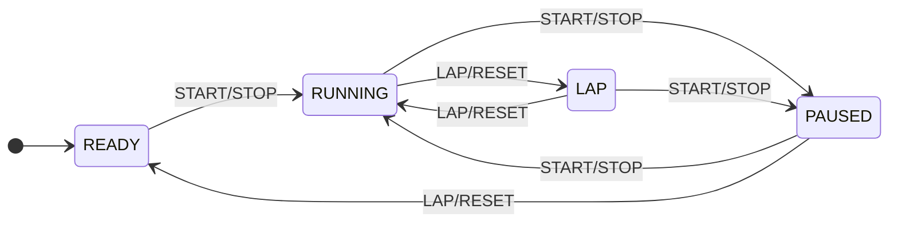

```mermaid
stateDiagram-v2
direction LR

[*] --> READY

state READY : 00:00:00 / CHRONO
state RUNNING : counting up / RUN
state LAP : lap display / running
state PAUSED : paused / RUN + STOP

READY --> RUNNING : START/STOP

RUNNING --> LAP : LAP/RESET
RUNNING --> PAUSED : START/STOP

LAP --> RUNNING : LAP/RESET
LAP --> PAUSED : START/STOP

PAUSED --> RUNNING : START/STOP
PAUSED --> READY : LAP/RESET
```