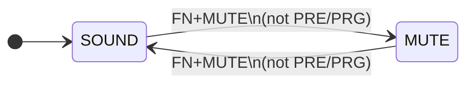

```mermaid
stateDiagram-v2
direction LR

[*] --> SOUND

state SOUND : buzzer ON
state MUTE : buzzer muted\nMUTE LED

SOUND --> MUTE : FN+MUTE\n(not PRE/PRG)
MUTE --> SOUND : FN+MUTE\n(not PRE/PRG)
```