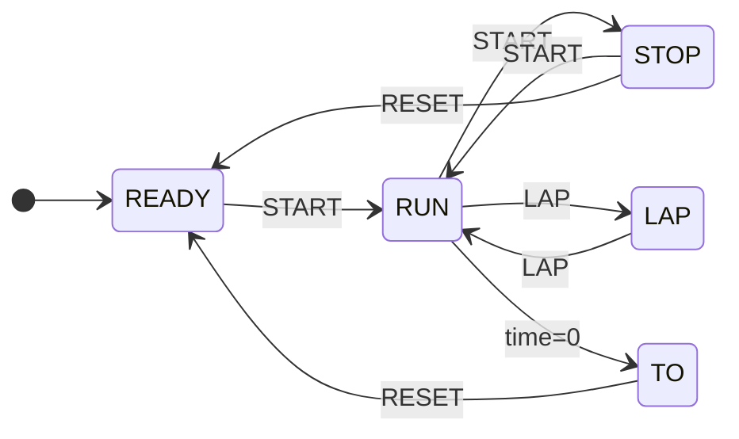

```mermaid
stateDiagram-v2
direction LR

[*] --> READY

state READY : STOP / ready
state RUN : RUN
state STOP : RUN+STOP
state LAP : RUN / LAP
state TO : T/O

READY --> RUN : START

RUN --> STOP : START
STOP --> RUN : START

RUN --> LAP : LAP
LAP --> RUN : LAP

STOP --> READY : RESET

RUN --> TO : time=0

TO --> READY : RESET
```