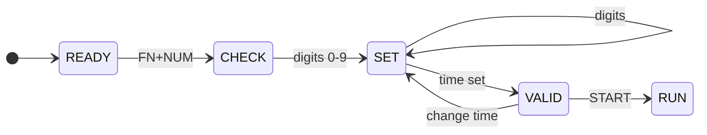

```mermaid
stateDiagram-v2
direction LR

[*] --> READY

state READY : STOP / ready
state CHECK : NUM=ON\nPRE=off\nPRG=off
state SET : numeric entry
state VALID : time != 00:00:00
state RUN : RUN

READY --> CHECK : FN+NUM

CHECK --> SET : digits 0-9
SET --> SET : digits

SET --> VALID : time set

VALID --> RUN : START

VALID --> SET : change time
```