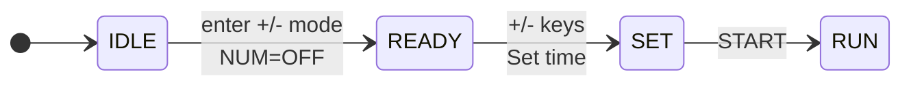

```mermaid
stateDiagram-v2
direction LR

[*] --> IDLE

state IDLE : STOP / ready
state READY : +/- set time
state RUN : RUN

IDLE --> READY : enter +/- mode<BR>NUM=OFF
READY --> SET : +/- keys<BR>Set time

SET --> RUN : START

```