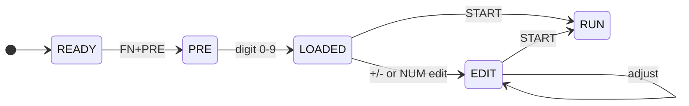

```mermaid
stateDiagram-v2
direction LR

[*] --> READY

state READY : STOP / ready
state PRE : PRE + NUM
state LOADED : preset shown
state EDIT : edit time
state RUN : RUN

READY --> PRE : FN+PRE

PRE --> LOADED : digit 0-9

LOADED --> EDIT : +/- or NUM edit
EDIT --> EDIT : adjust

LOADED --> RUN : START
EDIT --> RUN : START
```